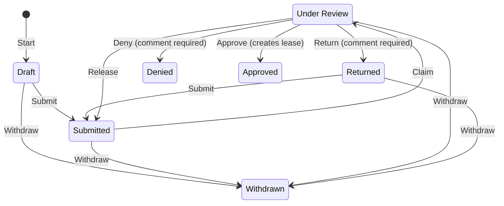
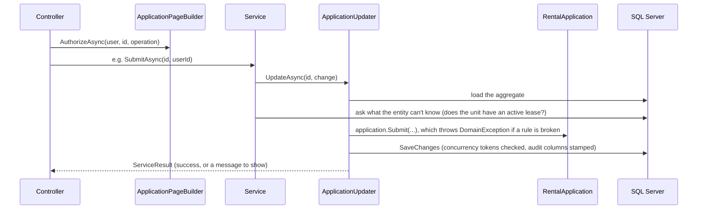

# Architecture

## Projects and dependency direction

| Project | Holds | References |
| --- | --- | --- |
| `src/PropertyManagement.Core` | Entities, business rules, validation rules, the `Address` value object, DTOs, `BusinessTimeProvider` | nothing |
| `src/PropertyManagement.Data` | `PropertyManagementDbContext`, `AppUser`, EF configurations, migrations, seeding, the audit interceptor, services, data queries | Core |
| `src/PropertyManagement.Web` | Controllers, Razor views and partials, view components, view models, presentation queries, authorization, `Program.cs` | Data, Core |

Core has no reference to EF Core or ASP.NET Core, so its rules are unit tested with plain objects. For the scope of this application, a separate application project wasn't necessary; the workflow services stay in Data, close to the persistence concerns they coordinate.

## Domain in brief

- **`AppUser`** is an Identity account with a name, email and one role: `Applicant` or `PropertyManager`. An **`Applicant`** row is one person's place on one application, holding the details they entered for it. The first applicant is the primary; co-applicants have the same rights.
- A **`Property`** owns **`Unit`**s, and each unit has a **`UnitType`**. An inactive type stays on units that already use it but can't be chosen for any other unit.
- An application is for one unit and has two sections, **applicant information** (per applicant) and **residence history** (shared), plus a read-only **summary** where it's submitted.
- **Approval** creates a **`Lease`** with a 12-month term. A unit is **available** when no lease covers today, in the business time zone.
- **Manager notes** are internal to property managers.

- **Editable by applicants:** Draft and Returned.
- **Terminal:** Approved, Denied and Withdrawn.
- **Status history:** every change is recorded (who, when, comment) and shown to managers.
- **Active-lease check:** runs at start, at submit and at approval. Approval also rejects a lease that would overlap.

## The rental-application write path

**Controller → authorization → service → `ApplicationUpdater` → entity → EF Core → SQL Server**

- **Authorization** answers "may this user attempt this?"
- **The entity** answers "is it valid now?" and changes its own state.
- **The service** supplies database facts, saves and runs transactions.
- **`ApplicationUpdater`** turns broken rules, stale saves and deadlocks into a `ServiceResult` and logs them.
- **`AuditSaveChangesInterceptor`** stamps created and modified by/at.

Properties, units and notes follow the same shape through `PropertyService` and `ManagerNoteService`.

## The read path

**Controller / view component / API → query class → EF projection → view model**

- Reads use `AsNoTracking` and project into the page's shape, so filtering, sorting and paging run in SQL.
- `Data/Queries` answers questions about the data. `Web/Queries` returns view models.
- The application page is the exception: `ApplicationPageBuilder` loads the aggregate without tracking, because authorization and the editable-or-read-only decision need the real entity.

## Aggregate boundaries

| Aggregate root | Owns | Changed only through |
| --- | --- | --- |
| `RentalApplication` | `Applicant`s, `ResidenceHistory`, `StatusHistory`, the `Lease` it creates | its methods (`Submit`, `Claim`, `Approve`, …) |
| `Property` | `Unit`s | `AddUnit`, `UpdateUnit`, `RemoveUnit` |
| `ManagerNote` | itself; foreign key to the application, no navigation | `ManagerNoteService` |

## Authorization

1. **A fallback policy** requires sign-in everywhere except the home page, the account pages, static files and, outside production, OpenAPI and Scalar.
2. **Role policies** (`PropertyManager`, `Applicant`) sit on controllers and actions.
3. **`RentalApplicationAuthorizationHandler`** decides `View`, `Edit`, `Withdraw`, `Review` and `ManageNotes` for a specific application.

A user who can't view an application gets **404**; one who can view it but not perform the action gets **403**. The same checks set the UI flags (`CanEdit`, `CanReview`, `CanManageNotes`). Antiforgery tokens are validated on every POST, and `/api` returns 401 and 403 instead of redirecting.

## Concurrency

| What | Protected by |
| --- | --- |
| An applicant's own details | SQL `rowversion` on `Applicant` |
| The shared residence list | `ResidenceSectionVersion` concurrency token, renewed on every residence change |
| Claims and reviews | `Status` is a concurrency token |
| Two approvals for one unit | Serializable transaction around "check for a conflicting lease, then insert", with deadlock handling |

Saves to different sections don't interfere with each other; the same section saved twice is rejected as stale.

## UI

- **Rendering:** server-rendered Razor with Bootstrap and a small theme layer in `site.css`.
- **The shared modal** (`modal.js`): a failed POST returns **422** with the same partial, which re-renders in place. A successful POST returns JSON, the modal closes, and the sections named in `data-modal-refresh` reload from their `data-refresh-url`.
- **The application page:** one view model and one form. The clicked button (`continue`, `back`, `submit`) decides the action. Each section is a partial, rendered editable or read-only by a server decision.
- **The application list:** the reusable grid (`GridViewComponent` + `grid.js`) over `GET /api/applications`, documented with OpenAPI. Its state lives in the URL.

## Cross-cutting

- **Time:** `timeProvider.Today()` is the date in `Business:TimeZone`; timestamps are UTC.
- **Logging:** status changes are logged at Information; refused, stale and deadlocked changes and failed sign-ins at Warning. Ids only.
- **Startup:** `DbInitializer` applies migrations and seeds idempotently.
- **Feature switch:** `Features:SaveInvalidSections`, read per request.
