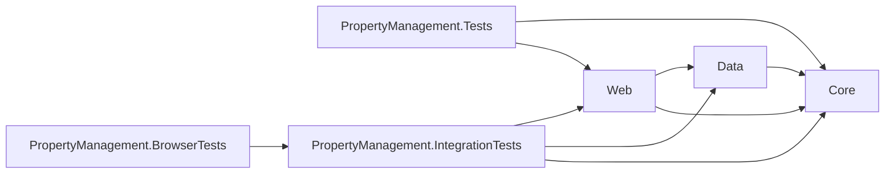
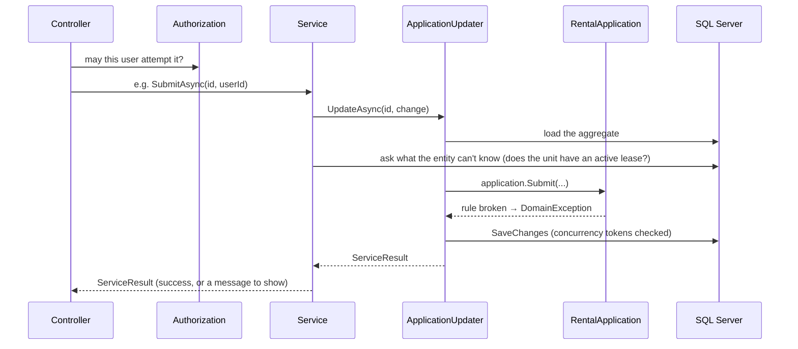
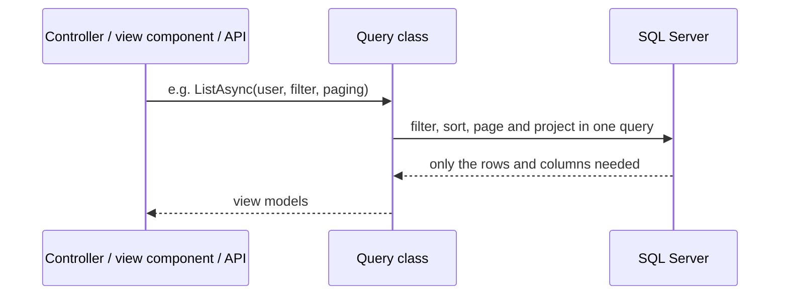

# Architecture overview

## Projects

| Project | Holds | Depends on |
| --- | --- | --- |
| `PropertyManagement.Core` | Entities, business rules, validation rules, value objects, DTOs | nothing |
| `PropertyManagement.Data` | `PropertyManagementDbContext`, EF configurations, migrations, seeding, auditing, services, data queries | Core |
| `PropertyManagement.Web` | Controllers, views, view components, view models, presentation queries, authorization, startup | Data, Core |

Core has no reference to EF Core or ASP.NET Core, so the rules can be unit tested without a database or a web server.

There is deliberately no separate application layer. The use cases (start, submit, claim, approve and so on) are services in Data, next to the `DbContext` they coordinate. With one front end, another project would add indirection without separating anything that changes independently.

## A write

- **Authorization** answers "may this user attempt this?" ([0007](decisions/0007-authorization.md)).
- **The entity** answers "is it valid now?" and changes its own state ([0001](decisions/0001-rich-domain-model.md)).
- **The service** supplies facts the entity can't look up, saves, and turns expected failures into a `ServiceResult` ([0006](decisions/0006-service-result.md)).
- **`ApplicationUpdater`** keeps load → change → save → translate errors in one place, including stale saves and deadlocks ([0005](decisions/0005-concurrency.md)).
- **The audit interceptor** stamps who changed what and when, so no service sets audit columns by hand.

## A read

Reads don't load entities. They project straight into the shape a page needs, with `AsNoTracking`, so filtering, sorting and paging happen in SQL ([0002](decisions/0002-no-repository-pattern.md), [0003](decisions/0003-queries-in-data-vs-web.md)).

The one exception is the application page. It loads the aggregate without tracking, because the authorization handler and the editable-or-read-only decision both need the real entity.

## Pages and partial rendering
- Pages are server-rendered Razor. JavaScript is limited to `modal.js` (the shared modal) and `grid.js` (the reusable grid).
- Sections that refresh in place are view components with their own refresh URL, so the same markup renders on first load and after a change ([modal guide](guides/modal-pattern.md)).
- The application page is one view model and one form. The clicked button decides what the POST does.
