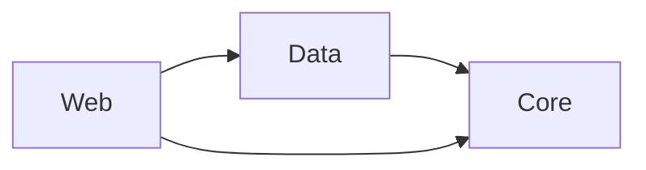
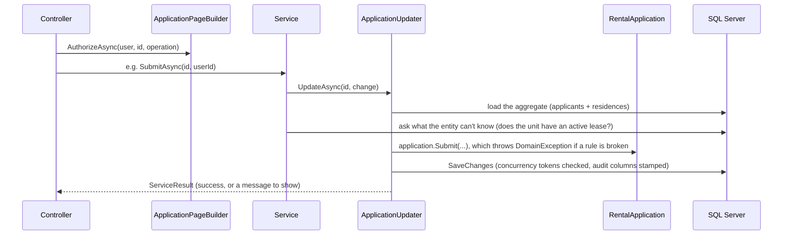

# Architecture

The system map. Read this first, then [domain](domain.md), [workflows](workflows.md), [decisions](decisions.md), [testing](testing.md) and [handoff](handoff.md).

## Projects and dependency direction

| Project | Holds | References |
| --- | --- | --- |
| `src/PropertyManagement.Core` | Entities, business rules, validation rules, the `Address` value object, DTOs, `BusinessTimeProvider` | nothing |
| `src/PropertyManagement.Data` | `PropertyManagementDbContext`, `AppUser`, EF configurations, migrations, seeding, the audit interceptor, services, data queries | Core |
| `src/PropertyManagement.Web` | Controllers, Razor views and partials, view components, view models, presentation queries, authorization, `Program.cs` | Data, Core |



- Core has no reference to EF Core or ASP.NET Core, so its rules are unit tested with plain objects.
- There is no separate application layer. Use cases (start, submit, claim, approve and so on) are services in Data, next to the `DbContext` they coordinate. With a single front end, another project would add indirection without separating anything that changes independently.

## Folder map

```
Core/
  Entities/        RentalApplication (aggregate root), Applicant, ResidenceHistory, StatusHistory,
                   ManagerNote, Property, Unit, UnitType, Lease, ApplicationStatusType
  Enums/           ApplicationStatus and its IsEditable / IsTerminal / DisplayName helpers
  Validation/      ApplicantDetailsRules, ResidenceSectionRules, FieldError
  Dtos/            ApplicantDetails, ResidenceDetails, PropertyDetails, UnitDetails, ResidenceInput
  Common/          DomainException, AuditableEntity, BusinessTimeProvider, TimeProviderExtensions.Today()
Data/
  Configurations/  one EF configuration per entity
  Migrations/      a single InitialSchema migration
  Seeding/         DbInitializer (migrate + seed on start), Identity/Property/Application seeders, Bogus data
  Auditing/        AuditSaveChangesInterceptor, ICurrentUser
  Services/        RentalApplicationService (applicant), ApplicationReviewService (manager),
                   ApplicationUpdater (shared load → change → save), PropertyService, ManagerNoteService,
                   ServiceResult, StaleDataException
  Queries/         LeaseQueries, ApplicationQueries, ManagerNoteQueries
Web/
  Controllers/     Applications, ApplicationResidences, ApplicationApplicants, Reviews, ManagerNotes,
                   Properties, Units, Account, Home, Api/ApplicationsApi
  Services/        ApplicationPageBuilder (load + authorize + build the application page), ApplicationAccess
  Queries/         page-shaped reads: Property, Unit, Review, Home, ApplicationSection, Applications/ApplicationListQuery
  Authorization/   Policies, ApplicationOperations, RentalApplicationAuthorizationHandler
  Infrastructure/  ModalResults, StatusBadges, FeatureOptions, User.Id()
  ViewComponents/  sections that render on first load and refresh in place
  Models/          view models by feature
  wwwroot/js/      modal.js (shared modal), grid.js (reusable grid)
```

## The write path

**Controller → authorization → service → `ApplicationUpdater` → entity → EF Core → SQL Server**



Each step has one job:
- **Authorization** answers "may this user attempt this?"
- **The entity** answers "is it valid now?" and changes its own state.
- **The service** supplies database facts, saves, and orchestrates transactions.
- **`ApplicationUpdater`** turns expected failures into a `ServiceResult`: broken rules, stale saves and deadlocks. It also logs them.
- **`AuditSaveChangesInterceptor`** stamps created and modified by/at from `ICurrentUser`. No service sets audit columns by hand.

Properties, units and notes follow the same shape through `PropertyService` and `ManagerNoteService`.

## The read path

**Controller / view component / API → query class → EF projection → view model**

- Reads use `AsNoTracking` and project straight into the page's shape, so filtering, sorting and paging run in SQL.
- `Data/Queries` answer questions about the data, such as lease availability. `Web/Queries` return view models. See [decisions](decisions.md#query-classes-without-cqrs-or-mediatr).
- The application page is the exception. `ApplicationPageBuilder` loads the aggregate without tracking, because the authorization handler and the editable-or-read-only decision need the real entity, then builds one `ApplicationPageViewModel`.

## Aggregate boundaries

| Aggregate root | Owns | Changed only through |
| --- | --- | --- |
| `RentalApplication` | `Applicant` rows, `ResidenceHistory`, `StatusHistory`, and the `Lease` it creates on approval | its methods (`Submit`, `Claim`, `Approve`, …) |
| `Property` | `Unit`s | `AddUnit`, `UpdateUnit`, `RemoveUnit` |
| `ManagerNote` | itself; foreign key to the application, no navigation | `ManagerNoteService` |
| `UnitType` | lookup (active or inactive) | seed data |

`AppUser` is the Identity account (login, name, email, role). An `Applicant` row is that person's place on one application. See [domain](domain.md).

## Authorization

1. **A fallback policy** requires sign-in everywhere except the home page, the account pages, static files and, outside production, OpenAPI and Scalar.
2. **Role policies** (`PropertyManager`, `Applicant`) sit on controllers and actions.
3. **`RentalApplicationAuthorizationHandler`** decides `View`, `Edit`, `Withdraw`, `Review` and `ManageNotes` for a specific application.

`ApplicationPageBuilder.AuthorizeAsync` checks `View` first and returns **404** when the user can't see the application, so ids don't leak. It returns **403** when they can see it but can't perform the operation. The same checks set the UI flags (`CanEdit`, `CanReview`, `CanManageNotes`, …), so buttons match what the server allows.

Antiforgery tokens are validated on every POST. Login return URLs must be local. `/api` returns 401 and 403 instead of redirecting.

## Concurrency

| What | Protected by |
| --- | --- |
| An applicant's own details | SQL `rowversion` on `Applicant`, compared with the version the page loaded |
| The shared residence list | `ResidenceSectionVersion` GUID on the application, a concurrency token that changes on every residence edit |
| Status changes (claim, review) | `Status` is a concurrency token |
| Two approvals for one unit | Serializable transaction around "check for a conflicting lease, then insert"; a deadlock loser gets a friendly message |

Different sections don't interfere with each other; the same section saved twice is rejected as stale. See [decisions](decisions.md#optimistic-concurrency-for-edits-a-serializable-transaction-for-approval).

## UI composition

- Server-rendered Razor with Bootstrap and a small theme layer (`wwwroot/css/site.css`).
- One shared modal (`modal.js`): failed POSTs return 422 with the partial, and successful ones return JSON and refresh targets. See [workflows](workflows.md#the-modal-pattern).
- The application page is one view model and one form; the clicked button (`command`) decides what happens. Each section is its own partial, rendered editable or read-only from a server decision.
- The application list is a reusable grid (`GridViewComponent` + `grid.js`) over `GET /api/applications`, documented with OpenAPI.

## Cross-cutting

- **Time:** a `TimeProvider` singleton using `Business:TimeZone`. `timeProvider.Today()` is the business date; timestamps are UTC.
- **Logging:** services log status changes at Information, and refused, stale and deadlocked changes and failed sign-ins at Warning. Ids only.
- **Startup:** `DbInitializer.InitializeAsync` applies migrations and seeds idempotently before the app serves requests.
- **Feature switches:** `Features:SaveInvalidSections`, read per request.
