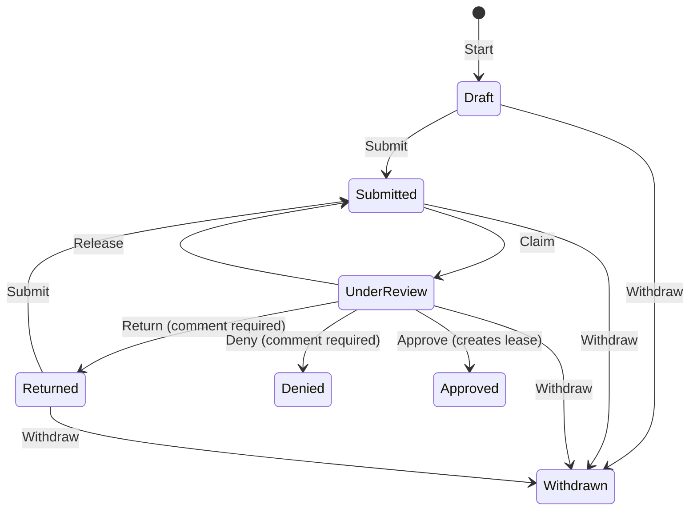

# Domain

The business concepts and the words the code uses for them.

## People

| Term | Meaning | In code |
| --- | --- | --- |
| **Account** | Someone who can sign in. Has a name, email, password and exactly one role. | `AppUser` (Identity user, in Data) |
| **Role** | `Applicant` or `PropertyManager`, chosen at sign-up. | `Roles` constants, Identity roles |
| **Applicant (on an application)** | An account's place on one specific application, holding the details they entered for it: name, phone, email, current address. The same account can be an applicant on several applications, with different details on each. | `Applicant` entity, one row per person per application |
| **Primary applicant** | The applicant who started the application. | `Applicant.IsPrimary` |
| **Co-applicant** | Another applicant account added to the application. They have the same rights as the primary. | `RentalApplication.AddApplicant` |
| **Property manager** | Maintains properties and units, reviews applications and writes notes. | role `PropertyManager` |

The account's name and email pre-fill an applicant's details, but they're separate data. See [decisions](decisions.md#appuser-and-applicant-are-separate).

## Properties and units

| Term | Meaning |
| --- | --- |
| **Property** | A building with a name and an address. Owns its units. |
| **Unit** | A rentable unit with a unit number (unique within its property), bedrooms (0–10), monthly rent (above zero) and a unit type. |
| **Unit type** | A lookup (for example Standard, Studio, Loft) that is **active** or **inactive**. An inactive type stays on units that already use it, but can't be chosen for any other unit. This is enforced in `Unit`, not just the form. |
| **Lease** | Created when an application is approved. It has a start date and a **12-month term**: the end date is the start date plus 12 months, minus a day. The start must be today or later, within 365 days. |
| **Available unit** | A unit with no lease covering **today**, where "today" means the business time zone's date. A future lease doesn't make a unit unavailable yet. |

A property or unit **can't be removed** while any of its units has applications or leases.

## Rental application

An application is for **one unit** and has two sections and a summary:

| Section | Contents | Complete when |
| --- | --- | --- |
| **Applicant information** | Each applicant's first and last name, phone, email and current address | every applicant on the application has saved their details without errors |
| **Residence history** | A shared list of prior residences, each with an address, landlord name and phone, and move-in and move-out dates (move-out can't be before move-in) | at least one residence, and the section has been saved |
| **Summary** | A read-only view of both sections, the list of anything blocking submission, and Submit | n/a |

The validation rules for each section live once in `Core/Validation`.

## Statuses

| Status | Meaning | Applicant can edit? | Terminal? |
| --- | --- | --- | --- |
| **Draft** | Started, not yet submitted | yes | no |
| **Submitted** | Waiting in the review queue | no | no |
| **Under Review** | Claimed by one property manager (bonus 2) | no | no |
| **Returned** | Sent back to the applicants for changes | yes | no |
| **Approved** | A lease was created | no | yes |
| **Denied** | Declined | no | yes |
| **Withdrawn** | Withdrawn by an applicant | no | yes |

Every change adds a **status history** row: from, to, who, when and an optional comment. Managers see this history on the application page; applicants don't.

## Review terms

| Term | Meaning |
| --- | --- |
| **Review queue** | Submitted applications waiting to be claimed, the current manager's claims, and claims held by other managers. |
| **Claim** | A manager takes a submitted application. It moves to Under Review and records who holds it and since when. Only that manager can release it or complete the review. |
| **Release** | The claiming manager puts it back to Submitted, and the claim is cleared. |
| **Review outcome** | Approve (with a lease start date), Return or Deny. Return and Deny require a comment. |
| **Manager note** | An internal note on an application. Managers can view, add, edit and remove them. Notes are never rendered or returned to applicants. |

## Rules checked at more than one point

- **Active lease:** checked when an application is started, when it's submitted, and when it's approved. At approval the check also rejects a lease that would overlap the new term. Other open applications for the same unit are left alone.
- **Section completeness:** listed on the Summary as blockers, and enforced again by `Submit`.
- **Editability:** decided on the server (`IsEditable` = Draft or Returned, plus being an applicant on the application). The same partials render editable or read-only.
